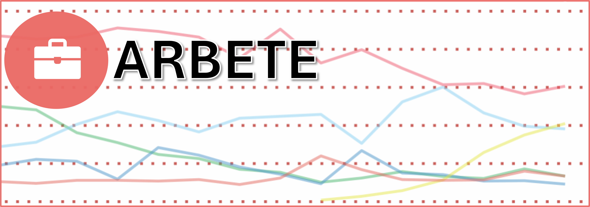
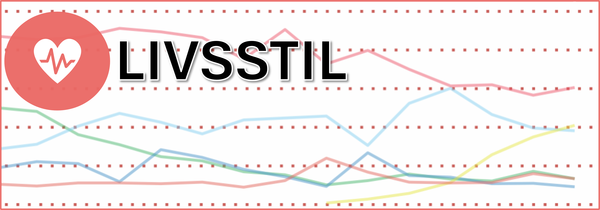

```{r setup, include=FALSE}
library(flexdashboard)
library(ggplot2)
library(stringr)
library(scales)
library(dplyr)
library(tidyr)
library(DT)
library(png)
library(data.table)
library(magrittr)
library(gridExtra)
library(openxlsx)
library(forcats)
library(patchwork)
library(ggthemes)
library(plotly)
library(ggridges)
library(forecast)
library(GGally)
library(cluster)
library(sf)
library(ggrepel)
library(ggtext)
library(readxl)
library(waffle)
```

```{r}
### Dataprep
library(readxl)

 # Hälsa
hälsa_bakgrund <- read_excel("data/hälsa_bakgrund.xlsx", 
    col_types = c("text", "text", "text", 
        "numeric"))

hälsa_inkomst <- read_excel("data/hälsa_inkomst.xlsx", 
    col_types = c("text", "text", "text", 
        "numeric"))

hälsa_utbildning <- read_excel("data/hälsa_utbildning.xlsx", 
    col_types = c("text", "text", "text", 
        "numeric"))

hälsa_kön <- read_excel("data/hälsa_kön.xlsx", 
    col_types = c("text", "text", "text", 
        "numeric"))

hälsa_ålder <- read_excel("data/hälsa_ålder.xlsx", 
    col_types = c("text", "text", "text", 
        "numeric"))


 # Rökning och snusning
rökningochsnusning_bakgrund <- read_excel("data/rökningochsnusning_bakgrund.xlsx")

rökningochsnusning_inkomst <- read_excel("data/rökningochsnusning_inkomst.xlsx")

rökningochsnusning_kön <- read_excel("data/rökningochsnusning_kön.xlsx")

rökningochsnusning_utbildning <- read_excel("data/rökningochsnusning_utbildning.xlsx")

rökningochsnusning_ålder <- read_excel("data/rökningochsnusning_ålder.xlsx")


 # Trygghet
trygghet_bakgrund <- read_excel("data/trygghet_bakgrund.xlsx")

trygghet_inkomst <- read_excel("data/trygghet_inkomst.xlsx")

trygghet_kön <- read_excel("data/trygghet_kön.xlsx", 
    col_types = c("text", "text", "text", 
        "numeric", "numeric", "numeric", 
        "numeric", "numeric", "numeric", 
        "numeric", "numeric", "numeric"))

trygghet_utbildning <- read_excel("data/trygghet_utbildning.xlsx")

trygghet_ålder <- read_excel("data/trygghet_ålder.xlsx")


 # Välbefinnande
välbefinnande_bakgrund <- read_excel("data/välbefinnande_bakgrund.xlsx")

välbefinnande_inkomst <- read_excel("data/välbefinnande_inkomst.xlsx")

välbefinnande_kön <- read_excel("data/välbefinnande_kön.xlsx")

välbefinnande_utbildning <- read_excel("data/välbefinnande_utbildning.xlsx")

välbefinnande_ålder <- read_excel("data/välbefinnande_ålder.xlsx")


# Tema
ss_theme <- theme(plot.background = element_rect(fill = "#EB6864") ,
                  plot.caption = element_text(hjust = 0) ,
                  panel.background = element_rect(fill = "white"),
                  axis.line.x = element_line(color = "black" , linewidth = 0.75) ,
                  axis.line.y = element_line(color = "black" , linewidth = 0.75) ,
                  plot.title = element_text(color = "white" , size = 16 , family = "sans"),
                  panel.grid.major.y  = element_line(color = "#B51E17" , linetype = "dotted"),
                  panel.grid.major.x = element_line(NULL),
                  panel.grid.minor = element_line(NULL),
                  legend.background = element_rect(fill = "white"),
                  legend.key = element_rect(fill = "white"),
                  legend.text = element_text(color = "black" , family = "sans") ,
                  legend.title = element_text(color = "black" , family = "sans") , 
                  text = element_text(size=12, face="plain", color = "white" , family = "sans"),
                  axis.title = element_text(color = "white" , family = "sans" , size = 18),
                  axis.text = element_text(color = "white" , family = "sans") ,
                  axis.text.x = element_text(size = 12))

```


# Översikt {data-orientation="rows"}
## {data-height=250 .tabset .tabset-pills}
### Om initiativet
*Svensk statistik* är ett initiativ med det huvudsakliga syftet att visualisera utvecklingen i Sverige utifrån ett antal parametrar. Genom SCB är Sverige ett land som ligger i framkant i att lagra registerdata och föra annan statistik på befolkningsnivå, men denna statistik är inte alltid så enkel att ta till sig. Detta är ett försök att förenkla möjligheten att ta till sig av denna data.

## {data-height=375 .tabset .tabset-pills}
### Om rapporten 
I denna rapport bemöts temat **Livsstil** utifrån dessa områden:
<br><br>
- **Välbefinnande**: Nöjdhet med livet och tillit till andra. <br>
- **Hälsa**: Allmän hälsa, sjukdom och änglan, oro och ångest. <br>
- **Rökning och snusning**: Daglig rökning och snusning. <br>
- **Trygghet**: Rädsla för att gå ut och utsatthet för våld och hot.
<br> <br>
Använd navigationspanelen högst upp för att se svaren utifrån olika områden. *Får figurerna inte plats på sidan? Testa att zooma ut genom att hålla in `Ctrl` + `-`.*


## {data-height=375}
###

<a href="https://lindw3.github.io/svenskstatistik-demokrati/">
```{r, echo=FALSE, out.width = "100%", out.height = "100%"}

knitr::include_graphics('bilder/demokrati.png')
```
</a>


###

<a href="https://lindw3.github.io/svenskstatistik-arbete/">
```{r, echo=FALSE, out.width = "100%", out.height = "100%"}

```
</a>

###

<a href="https://lindw3.github.io/svenskstatistik-livsstil/">
```{r, echo=FALSE, out.width = "100%", out.height = "100%"}

```
</a>


# Välbefinnande utifrån kön {data-navmenu="Välbefinnande" data-orientation="columns"}
## {.tabset .tabset-pills}
### Nöjdhet med livet, medelvärde utifrån 10-gradig skala

```{r}
välbefinnande_kön %>% 
  filter(Indikator == "Nöjd med livet, medelvärde") %>% 
  ggplot(aes(x = Kön , y = `2024-2024` ,
             text = paste(Kön , "\nMedelvärde: " , `2024-2024`))) +
  geom_col(fill = "#ffb1b1") +
  ylab("Medelvärde") + xlab(NULL) +
  labs(fill = "Välbefinnande") +
  scale_y_continuous(breaks = seq(0 , 10, 2) , limits = c(0 , 10)) +
  ss_theme  -> p_nöjdmedlivet_kön

ggplotly(p_nöjdmedlivet_kön, tooltip = "text") %>%
  config(displayModeBar = F)
```

## {.tabset .tabset-pills}
### Tillit till andra, medelvärde utifrån 10-gradig skala
```{r}
välbefinnande_kön %>% 
  filter(Indikator == "Litar på andra, medelvärde") %>% 
  ggplot(aes(x = Kön , y = `2024-2024` ,
             text = paste(Kön , "\nMedelvärde: " , `2024-2024`))) +
  geom_col(fill = "#ffb1b1") +
  ylab("Medelvärde") + xlab(NULL) +
  labs(fill = "Välbefinnande") +
  scale_y_continuous(breaks = seq(0 , 10, 2) , limits = c(0 , 10)) +
  ss_theme  -> p_tillit_kön

ggplotly(p_tillit_kön, tooltip = "text") %>%
  config(displayModeBar = F)
```


# Välbefinnande utifrån ålder {data-navmenu="Välbefinnande" data-orientation="columns"}
## {.tabset .tabset-pills}
### Nöjdhet med livet, medelvärde utifrån 10-gradig skala

```{r}
välbefinnande_ålder %>% 
  filter(Indikator == "Nöjd med livet, medelvärde") %>% 
  ggplot(aes(x = Ålder , y = `2024-2024` ,
             text = paste(Ålder , "\nMedelvärde: " , `2024-2024`))) +
  geom_col(fill = "#ffb1b1") +
  ylab("Medelvärde") + xlab(NULL) +
  labs(fill = "Välbefinnande") +
  scale_y_continuous(breaks = seq(0 , 10, 2) , limits = c(0 , 10)) +
  ss_theme  -> p_nöjdmedlivet_ålder

ggplotly(p_nöjdmedlivet_ålder, tooltip = "text") %>%
  config(displayModeBar = F)
```

## {.tabset .tabset-pills}
### Tillit till andra, medelvärde utifrån 10-gradig skala
```{r}
välbefinnande_ålder %>% 
  filter(Indikator == "Litar på andra, medelvärde") %>% 
  ggplot(aes(x = Ålder , y = `2024-2024` ,
             text = paste(Ålder , "\nMedelvärde: " , `2024-2024`))) +
  geom_col(fill = "#ffb1b1") +
  ylab("Medelvärde") + xlab(NULL) +
  labs(fill = "Välbefinnande") +
  scale_y_continuous(breaks = seq(0 , 10, 2) , limits = c(0 , 10)) +
  ss_theme  -> p_tillit_ålder

ggplotly(p_tillit_ålder, tooltip = "text") %>%
  config(displayModeBar = F)
```


# Välbefinnande utifrån utbildningsnivå {data-navmenu="Välbefinnande" data-orientation="columns"}
## {.tabset .tabset-pills}
### Nöjdhet med livet, medelvärde utifrån 10-gradig skala

```{r}
levels = c("Förgymnasial utbildning" , 
           "Gymnasial utbildning" ,
           "Eftergymnasial utbildning, kortare än 3 år" ,
           "Eftergymnasial utbildning, 3 år eller längre")

välbefinnande_utbildning %>% 
  filter(Indikator == "Nöjd med livet, medelvärde") %>% 
  ggplot(aes(x = factor(Utbildning , levels = levels) , y = `2024-2024` ,
             text = paste(Utbildning , "\nMedelvärde: " , `2024-2024`))) +
  geom_col(fill = "#ffb1b1") +
  ylab("Medelvärde") + xlab(NULL) +
  labs(fill = "Välbefinnande") +
  ss_theme +
  theme(axis.text.x = element_text(angle = 70, hjust = 1 , vjust = 1)) +
  scale_y_continuous(breaks = seq(0 , 10, 2) , 
                     limits = c(0 , 10)) -> p_nöjdmedlivet_utbildning

ggplotly(p_nöjdmedlivet_utbildning, tooltip = "text") %>%
  config(displayModeBar = F)
```

## {.tabset .tabset-pills}
### Tillit till andra, medelvärde utifrån 10-gradig skala
```{r}
välbefinnande_utbildning %>% 
  filter(Indikator == "Litar på andra, medelvärde") %>% 
  ggplot(aes(x = factor(Utbildning, levels = levels) , y = `2024-2024` ,
             text = paste(Utbildning , "\nMedelvärde: " , `2024-2024`))) +
  geom_col(fill = "#ffb1b1") +
  ylab("Medelvärde") + xlab(NULL) +
  labs(fill = "Välbefinnande") +
  scale_y_continuous(breaks = seq(0 , 10, 2) , limits = c(0 , 10)) +
  ss_theme +  
  theme(axis.text.x = element_text(angle = 70, 
                                   hjust = 1 , vjust = 1)) -> p_tillit_utbildning

ggplotly(p_tillit_utbildning, tooltip = "text") %>%
  config(displayModeBar = F)
```


# Välbefinnande utifrån inkomst {data-navmenu="Välbefinnande" data-orientation="columns"}
## {.tabset .tabset-pills}
### Nöjdhet med livet, medelvärde utifrån 10-gradig skala

```{r}
välbefinnande_inkomst %>% 
  filter(Indikator == "Nöjd med livet, medelvärde") %>% 
  ggplot(aes(x = Inkomst , y = `2024-2024` ,
             text = paste(Inkomst , "\nMedelvärde: " , `2024-2024`))) +
  geom_col(fill = "#ffb1b1") +
  ylab("Medelvärde") + xlab(NULL) +
  labs(fill = "Välbefinnande") +
  scale_y_continuous(breaks = seq(0 , 10, 2) , limits = c(0 , 10)) +
  ss_theme  -> p_nöjdmedlivet_inkomst

ggplotly(p_nöjdmedlivet_inkomst, tooltip = "text") %>%
  config(displayModeBar = F)
```

## {.tabset .tabset-pills}
### Tillit till andra, medelvärde utifrån 10-gradig skala
```{r}
välbefinnande_inkomst %>% 
  filter(Indikator == "Litar på andra, medelvärde") %>% 
  ggplot(aes(x = Inkomst , y = `2024-2024` ,
             text = paste(Inkomst , "\nMedelvärde: " , `2024-2024`))) +
  geom_col(fill = "#ffb1b1") +
  ylab("Medelvärde") + xlab(NULL) +
  labs(fill = "Välbefinnande") +
  scale_y_continuous(breaks = seq(0 , 10, 2) , limits = c(0 , 10)) +
  ss_theme  -> p_tillit_inkomst

ggplotly(p_tillit_inkomst, tooltip = "text") %>%
  config(displayModeBar = F)
```


# Välbefinnande utifrån bakgrund {data-navmenu="Välbefinnande" data-orientation="columns"}
## {.tabset .tabset-pills}
### Nöjdhet med livet, medelvärde utifrån 10-gradig skala

```{r}
välbefinnande_bakgrund %>% 
  filter(Indikator == "Nöjd med livet, medelvärde") %>% 
  ggplot(aes(x = Bakgrund , y = `2024-2024` ,
             text = paste(Bakgrund , "\nMedelvärde: " , `2024-2024`))) +
  geom_col(fill = "#ffb1b1") +
  ylab("Medelvärde") + xlab(NULL) +
  labs(fill = "Välbefinnande") +
  scale_y_continuous(breaks = seq(0 , 10, 2) , limits = c(0 , 10)) +
  ss_theme  -> p_nöjdmedlivet_bakgrund

ggplotly(p_nöjdmedlivet_bakgrund, tooltip = "text") %>%
  config(displayModeBar = F)
```

## {.tabset .tabset-pills}
### Tillit till andra, medelvärde utifrån 10-gradig skala
```{r}
välbefinnande_bakgrund %>% 
  filter(Indikator == "Litar på andra, medelvärde") %>% 
  ggplot(aes(x = Bakgrund , y = `2024-2024` ,
             text = paste(Bakgrund , "\nMedelvärde: " , `2024-2024`))) +
  geom_col(fill = "#ffb1b1") +
  ylab("Medelvärde") + xlab(NULL) +
  labs(fill = "Välbefinnande") +
  scale_y_continuous(breaks = seq(0 , 10, 2) , limits = c(0 , 10)) +
  ss_theme  -> p_tillit_bakgrund

ggplotly(p_tillit_bakgrund, tooltip = "text") %>%
  config(displayModeBar = F)
```


# Hälsa utifrån kön {data-navmenu="Hälsa" data-orientation="columns"}
## {.tabset .tabset-pills}
### Långvarig sjukdom eller hälsoproblem
```{r}
hälsa_kön %>% 
  filter(Indikator == "Har långvarig sjukdom eller hälsoproblem" ,
         Kön != "Totalt") %>% 
  ggplot(aes(x = Kön , y = `2024-2024` / 100,
             text = paste(Kön , "\nAndel: " , `2024-2024`, "%"))) +
  geom_col(fill = "#ffb1b1") +
  scale_y_continuous(labels = scales::percent_format() ,
                     limits = c(0 , 0.55) ,
                     breaks = seq(0 , 0.5 , 0.1)) +
  ylab("Andel") + xlab(NULL) +
  ss_theme  -> p_hälsoproblem_kön

ggplotly(p_hälsoproblem_kön, tooltip = "text") %>%
  config(displayModeBar = F)
```

## {.tabset .tabset-pills}
### Besvär av ängslan, oro eller ångest
```{r}
hälsa_kön %>% 
  filter(Indikator == "Har besvär av ängslan, oro eller ångest" ,
         Kön != "Totalt") %>% 
  ggplot(aes(x = Kön , y = `2024-2024` / 100 ,
             text = paste(Kön , "\nAndel: " , `2024-2024`, "%"))) +
  geom_col(fill = "#ffb1b1") +
  scale_y_continuous(labels = scales::percent_format() ,
                     limits = c(0 , 0.55)  ,
                     breaks = seq(0 , 0.5 , 0.1)) +
  ylab("Andel") + xlab(NULL) +
  ss_theme  -> p_ångest_kön

ggplotly(p_ångest_kön, tooltip = "text") %>%
  config(displayModeBar = F)
```

## {.tabset .tabset-pills}
### Upplevd dålig hälsa
```{r}
hälsa_kön %>% 
  filter(Indikator == "Dålig hälsa" ,
         Kön != "Totalt") %>% 
  ggplot(aes(x = Kön , y = `2024-2024` / 100 ,
             text = paste(Kön , "\nAndel: " , `2024-2024`, "%"))) +
  geom_col(fill = "#ffb1b1") +
  ylab("Andel") + xlab(NULL) +
  scale_y_continuous(labels = scales::percent_format() ,
                     limits = c(0 , 0.55)  ,
                     breaks = seq(0 , 0.5 , 0.1)) +
  ss_theme  -> p_dålighälsa_kön

ggplotly(p_dålighälsa_kön, tooltip = "text") %>%
  config(displayModeBar = F)
```


# Hälsa utifrån ålder {data-navmenu="Hälsa" data-orientation="columns"}
## {.tabset .tabset-pills}
### Långvarig sjukdom eller hälsoproblem
```{r}
hälsa_ålder %>% 
  filter(Indikator == "Har långvarig sjukdom eller hälsoproblem") %>% 
  ggplot(aes(x = Ålder , y = `2024-2024` / 100 ,
             text = paste(Ålder , "\nAndel: " , `2024-2024`, "%"))) +
  geom_col(fill = "#ffb1b1") +
  ylab("Andel") + xlab(NULL) +
  scale_y_continuous(labels = scales::percent_format() ,
                     limits = c(0 , 0.602)) +
  ss_theme  -> p_hälsoproblem_ålder

ggplotly(p_hälsoproblem_ålder, tooltip = "text") %>%
  config(displayModeBar = F)
```

## {.tabset .tabset-pills}
### Besvär av ängslan, oro eller ångest
```{r}
hälsa_ålder %>% 
  filter(Indikator == "Har besvär av ängslan, oro eller ångest") %>% 
  ggplot(aes(x = Ålder , y = `2024-2024` / 100 ,
             text = paste(Ålder , "\nAndel: " , `2024-2024`, "%"))) +
  geom_col(fill = "#ffb1b1") +
  scale_y_continuous(labels = scales::percent_format() ,
                     limits = c(0 , 0.6)) +
  ylab("Andel") + xlab(NULL) +
  ss_theme  -> p_ångest_ålder

ggplotly(p_ångest_ålder, tooltip = "text") %>%
  config(displayModeBar = F)
```

## {.tabset .tabset-pills}
### Upplevd dålig hälsa
```{r}
hälsa_ålder %>% 
  filter(Indikator == "Dålig hälsa") %>% 
  ggplot(aes(x = Ålder , y = `2024-2024` / 100 ,
             text = paste(Ålder , "\nAndel: " , `2024-2024`, "%"))) +
  geom_col(fill = "#ffb1b1") +
  ylab("Andel") + xlab(NULL) +
  scale_y_continuous(labels = scales::percent_format() ,
                     limits = c(0 , 0.6)) +
  ss_theme  -> p_dålighälsa_ålder

ggplotly(p_dålighälsa_ålder, tooltip = "text") %>%
  config(displayModeBar = F)
```


# Hälsa utifrån utbildning {data-navmenu="Hälsa" data-orientation="columns"}
## {.tabset .tabset-pills}
### Långvarig sjukdom eller hälsoproblem
```{r}
hälsa_utbildning %>% 
  filter(Indikator == "Har långvarig sjukdom eller hälsoproblem") %>% 
  ggplot(aes(x = factor(Utbildning, levels = levels) , y = `2024-2024` / 100 ,
             text = paste(Utbildning , "\nAndel: " , `2024-2024`, "%"))) +
  geom_col(fill = "#ffb1b1") +
  ylab("Andel") + xlab(NULL) +
  scale_y_continuous(labels = scales::percent_format() ,
                     limits = c(0 , 0.5)) +
  theme(axis.text.x = element_text(angle = 70, hjust = 1 , vjust = 1)) +
  ss_theme  -> p_hälsoproblem_utbildning

ggplotly(p_hälsoproblem_utbildning, tooltip = "text") %>%
  config(displayModeBar = F)
```

## {.tabset .tabset-pills}
### Besvär av ängslan, oro eller ångest
```{r}
hälsa_utbildning %>% 
  filter(Indikator == "Har besvär av ängslan, oro eller ångest") %>% 
  ggplot(aes(x = factor(Utbildning, levels = levels) , y = `2024-2024` / 100 ,
             text = paste(Utbildning , "\nAndel: " , `2024-2024`, "%"))) +
  geom_col(fill = "#ffb1b1") +
  scale_y_continuous(labels = scales::percent_format() ,
                     limits = c(0 , 0.5)) +
  theme(axis.text.x = element_text(angle = 70, hjust = 1 , vjust = 1)) +
  ylab("Andel") + xlab(NULL) +
  ss_theme  -> p_ångest_utbildning

ggplotly(p_ångest_utbildning, tooltip = "text") %>%
  config(displayModeBar = F)
```

## {.tabset .tabset-pills}
### Upplevd dålig hälsa
```{r}
levels = c("Förgymnasial utbildning" , 
           "Gymnasial utbildning" ,
           "Eftergymnasial utbildning, kortare än 3 år" ,
           "Eftergymnasial utbildning, 3 år eller längre")

hälsa_utbildning %>% 
  filter(Indikator == "Dålig hälsa") %>% 
  ggplot(aes(x = factor(Utbildning , levels) , y = `2024-2024` / 100 ,
             text = paste(Utbildning , "\nAndel: " , `2024-2024`, "%"))) +
  geom_col(fill = "#ffb1b1") +
  ylab("Andel") + xlab(NULL) +
  scale_y_continuous(labels = scales::percent_format() ,
                     limits = c(0 , 0.5)) +
  theme(axis.text.x = element_text(angle = 70, hjust = 1 , vjust = 1)) +
  ss_theme  -> p_dålighälsa_utbildning

ggplotly(p_dålighälsa_utbildning, tooltip = "text") %>%
  config(displayModeBar = F)
```


# Hälsa utifrån inkomst {data-navmenu="Hälsa" data-orientation="columns"}
## {.tabset .tabset-pills}
### Långvarig sjukdom eller hälsoproblem
```{r}
hälsa_inkomst %>% 
  filter(Indikator == "Har långvarig sjukdom eller hälsoproblem") %>% 
  ggplot(aes(x = Inkomst , y = `2024-2024` / 100 ,
             text = paste(Inkomst , "\nAndel: " , `2024-2024`, "%"))) +
  geom_col(fill = "#ffb1b1") +
  ylab("Andel") + xlab(NULL) +
  scale_y_continuous(labels = scales::percent_format() , 
                     limits = c(0 , 0.5)) +
  ss_theme  -> p_hälsoproblem_inkomst

ggplotly(p_hälsoproblem_inkomst, tooltip = "text") %>%
  config(displayModeBar = F)
```

## {.tabset .tabset-pills}
### Besvär av ängslan, oro eller ångest
```{r}
hälsa_inkomst %>% 
  filter(Indikator == "Har besvär av ängslan, oro eller ångest") %>% 
  ggplot(aes(x = Inkomst , y = `2024-2024` / 100 ,
             text = paste(Inkomst , "\nAndel: " , `2024-2024`, "%"))) +
  geom_col(fill = "#ffb1b1") +
  scale_y_continuous(labels = scales::percent_format() , 
                     limits = c(0 , 0.5)) +
  ylab("Andel") + xlab(NULL) +
  ss_theme  -> p_ångest_inkomst

ggplotly(p_ångest_inkomst, tooltip = "text") %>%
  config(displayModeBar = F)
```

## {.tabset .tabset-pills}
### Upplevd dålig hälsa
```{r}
hälsa_inkomst %>% 
  filter(Indikator == "Dålig hälsa") %>% 
  ggplot(aes(x = Inkomst , y = `2024-2024` / 100 ,
             text = paste(Inkomst , "\nAndel: " , `2024-2024`, "%"))) +
  geom_col(fill = "#ffb1b1") +
  ylab("Andel") + xlab(NULL) +
  scale_y_continuous(labels = scales::percent_format() , 
                     limits = c(0 , 0.5)) +
  ss_theme  -> p_dålighälsa_inkomst

ggplotly(p_dålighälsa_inkomst, tooltip = "text") %>%
  config(displayModeBar = F)
```


# Hälsa utifrån bakgrund {data-navmenu="Hälsa" data-orientation="columns"}
## {.tabset .tabset-pills}
### Långvarig sjukdom eller hälsoproblem
```{r}
hälsa_bakgrund %>% 
  filter(Indikator == "Har långvarig sjukdom eller hälsoproblem") %>% 
  ggplot(aes(x = Bakgrund , y = `2024-2024` / 100 ,
             text = paste(Bakgrund , "\nAndel: " , `2024-2024`, "%"))) +
  geom_col(fill = "#ffb1b1") +
  ylab("Andel") + xlab(NULL) +
  scale_y_continuous(labels = scales::percent_format() , 
                     limits = c(0 , 0.5)) +
  ss_theme  -> p_hälsoproblem_bakgrund

ggplotly(p_hälsoproblem_bakgrund, tooltip = "text") %>%
  config(displayModeBar = F)
```

## {.tabset .tabset-pills}
### Besvär av ängslan, oro eller ångest
```{r}
hälsa_bakgrund %>% 
  filter(Indikator == "Har besvär av ängslan, oro eller ångest") %>% 
  ggplot(aes(x = Bakgrund , y = `2024-2024` / 100 ,
             text = paste(Bakgrund , "\nAndel: " , `2024-2024`, "%"))) +
  geom_col(fill = "#ffb1b1") +
  scale_y_continuous(labels = scales::percent_format() , 
                     limits = c(0 , 0.5)) +
  ylab("Andel") + xlab(NULL) +
  ss_theme  -> p_ångest_bakgrund

ggplotly(p_ångest_bakgrund, tooltip = "text") %>%
  config(displayModeBar = F)
```

## {.tabset .tabset-pills}
### Upplevd dålig hälsa
```{r}
hälsa_bakgrund %>% 
  filter(Indikator == "Dålig hälsa") %>% 
  ggplot(aes(x = Bakgrund , y = `2024-2024` / 100 ,
             text = paste(Bakgrund , "\nAndel: " , `2024-2024`, "%"))) +
  geom_col(fill = "#ffb1b1") +
  ylab("Andel") + xlab(NULL) +
  scale_y_continuous(labels = scales::percent_format() , 
                     limits = c(0 , 0.5)) +
  ss_theme  -> p_dålighälsa_bakgrund

ggplotly(p_dålighälsa_bakgrund, tooltip = "text") %>%
  config(displayModeBar = F)
```


# Rökning och snusning utifrån kön {data-navmenu="Rökning och snusning" data-orientation="columns"}
## {.tabset .tabset-pills}
### Röker dagligen

```{r}
rökningochsnusning_kön %>% 
  filter(Kön != "Totalt") %>% 
  pivot_longer(!c(Indikator, Ålder, Kön) , 
               values_to = "Andel" ,
               names_to = "År") %>% 
  filter(Indikator == "Röker dagligen") %>% 
  ggplot(aes(x = År , y = Andel/100 , group = Kön , colour = Kön,
             text = paste(År, "\n", Kön , "\nAndel: " , Andel, "%"))) +
  geom_line(linewidth = 1) +
  ylab("Andel") + xlab(NULL) +
  scale_y_continuous(limits = c(0, 0.5), 
                     labels = scales::percent_format(accuracy = 1)) +
  scale_x_discrete(breaks = c("2008-2009" , "2024-2024") ,
                   labels = c("2008" , "2024")) +
  scale_color_manual(values = c("Kvinnor" = "#ffb1b1",
                               "Män" = "#64b6ee")) +
  ss_theme  -> p_rökerdagligen_kön

ggplotly(p_rökerdagligen_kön, tooltip = "text") %>%
  config(displayModeBar = F)
```

## {.tabset .tabset-pills}
### Snusar dagligen
```{r}
rökningochsnusning_kön %>% 
  filter(Kön != "Totalt") %>% 
  pivot_longer(!c(Indikator, Ålder, Kön) , 
               values_to = "Andel" ,
               names_to = "År") %>% 
  filter(Indikator == "Snusar dagligen") %>% 
  ggplot(aes(x = År , y = Andel/100 , group = Kön , colour = Kön,
             text = paste(År, "\n", Kön , "\nAndel: " , Andel, "%"))) +
  geom_line(linewidth = 1) +
  ylab("Andel") + xlab(NULL) +
  scale_y_continuous(limits = c(0, 0.5),  
                     labels = scales::percent_format(accuracy = 1)) +
  scale_x_discrete(breaks = c("2008-2009" , "2024-2024") ,
                   labels = c("2008" , "2024")) +
  scale_color_manual(values = c("Kvinnor" = "#ffb1b1",
                               "Män" = "#64b6ee")) +
  ss_theme  -> p_snusardagligen_kön

ggplotly(p_snusardagligen_kön, tooltip = "text") %>%
  config(displayModeBar = F)
```


# Rökning och snusning utifrån ålder {data-navmenu="Rökning och snusning" data-orientation="columns"}
## {.tabset .tabset-pills}
### Röker dagligen

```{r}
rökningochsnusning_ålder %>% 
  filter(Indikator == "Röker dagligen") %>% 
  ggplot(aes(x = Ålder , y = `2024-2024`/100 ,
             text = paste(Ålder , "\nAndel: " , `2024-2024`, "%"))) +
  geom_col(fill = "#ffb1b1") +
  ylab("Andel") + xlab(NULL) +
  scale_y_continuous(limits = c(0, 0.5),  
                     labels = scales::percent_format(accuracy = 1)) +
  ss_theme  -> p_rökerdagligen_ålder

ggplotly(p_rökerdagligen_ålder, tooltip = "text") %>%
  config(displayModeBar = F)
```

## {.tabset .tabset-pills}
### Snusar dagligen
```{r}
rökningochsnusning_ålder %>% 
  filter(Indikator == "Snusar dagligen") %>% 
  ggplot(aes(x = Ålder , y = `2024-2024`/100 ,
             text = paste(Ålder , "\nAndel: " , `2024-2024`, "%"))) +
  geom_col(fill = "#ffb1b1") +
  ylab("Andel") + xlab(NULL) +
  scale_y_continuous(limits = c(0, 0.5),  
                     labels = scales::percent_format(accuracy = 1)) +
  ss_theme  -> p_snusardagligen_ålder

ggplotly(p_snusardagligen_ålder, tooltip = "text") %>%
  config(displayModeBar = F)
```


# Rökning och snusning utifrån utbildningsnivå {data-navmenu="Rökning och snusning" data-orientation="columns"}
## {.tabset .tabset-pills}
### Röker dagligen

```{r}
levels = c("Förgymnasial utbildning" , 
           "Gymnasial utbildning" ,
           "Eftergymnasial utbildning, kortare än 3 år" ,
           "Eftergymnasial utbildning, 3 år eller längre")

rökningochsnusning_utbildning %>% 
  filter(Indikator == "Röker dagligen") %>% 
  ggplot(aes(x = factor(Utbildning , levels = levels) , y = `2024-2024` / 100 ,
             text = paste(Utbildning , "\nAndel: " , `2024-2024` , "%"))) +
  geom_col(fill = "#ffb1b1") +
  ylab("Andel") + xlab(NULL) +
  ss_theme +
  theme(axis.text.x = element_text(angle = 70, hjust = 1 , vjust = 1)) +
  scale_y_continuous(limits = c(0, 0.5),  
                     labels = scales::percent_format(accuracy = 1)) -> p_rökerdagligen_utbildning

ggplotly(p_rökerdagligen_utbildning, tooltip = "text") %>%
  config(displayModeBar = F)
```

## {.tabset .tabset-pills}
### Snusar dagligen
```{r}
rökningochsnusning_utbildning %>% 
  filter(Indikator == "Snusar dagligen") %>% 
  ggplot(aes(x = factor(Utbildning , levels = levels) , y = `2024-2024` / 100 ,
             text = paste(Utbildning , "\nAndel: " , `2024-2024` , "%"))) +
  geom_col(fill = "#ffb1b1") +
  ylab("Andel") + xlab(NULL) +
  ss_theme +
  theme(axis.text.x = element_text(angle = 70, hjust = 1 , vjust = 1)) +
  scale_y_continuous(limits = c(0, 0.5),  
                     labels = scales::percent_format(accuracy = 1)) -> p_snusardagligen_utbildning

ggplotly(p_snusardagligen_utbildning, tooltip = "text") %>%
  config(displayModeBar = F)

ggplotly(p_tillit_utbildning, tooltip = "text") %>%
  config(displayModeBar = F)
```


# Rökning och snusning utifrån inkomst {data-navmenu="Rökning och snusning" data-orientation="columns"}
## {.tabset .tabset-pills}
### Röker dagligen

```{r}
rökningochsnusning_inkomst %>% 
  filter(Indikator == "Röker dagligen") %>% 
  ggplot(aes(x = Inkomst , y = `2024-2024` / 100 ,
             text = paste(Inkomst , "\nAndel: " , `2024-2024`, "%"))) +
  geom_col(fill = "#ffb1b1") +
  ylab("Andel") + xlab(NULL) +
  scale_y_continuous(limits = c(0, 0.5),  
                     labels = scales::percent_format(accuracy = 1)) +
  ss_theme  -> p_rökerdagligen_inkomst

ggplotly(p_rökerdagligen_inkomst, tooltip = "text") %>%
  config(displayModeBar = F)
```

## {.tabset .tabset-pills}
### Snusar dagligen
```{r}
rökningochsnusning_inkomst %>% 
  filter(Indikator == "Snusar dagligen") %>% 
  ggplot(aes(x = Inkomst , y = `2024-2024` / 100 ,
             text = paste(Inkomst , "\nAndel: " , `2024-2024`, "%"))) +
  geom_col(fill = "#ffb1b1") +
  ylab("Andel") + xlab(NULL) +
  scale_y_continuous(limits = c(0, 0.5),  
                     labels = scales::percent_format(accuracy = 1)) +
  ss_theme  -> p_snusardagligen_inkomst

ggplotly(p_snusardagligen_inkomst, tooltip = "text") %>%
  config(displayModeBar = F)
```


# Rökning och snusning utifrån bakgrund {data-navmenu="Rökning och snusning" data-orientation="columns"}
## {.tabset .tabset-pills}
### Röker dagligen

```{r}
rökningochsnusning_bakgrund %>% 
  filter(Indikator == "Röker dagligen") %>% 
  ggplot(aes(x = Bakgrund , y = `2024-2024` / 100 ,
             text = paste(Bakgrund , "\nAndel: " , `2024-2024`, "%"))) +
  geom_col(fill = "#ffb1b1") +
  ylab("Andel") + xlab(NULL) +
  scale_y_continuous(limits = c(0, 0.5),  
                     labels = scales::percent_format(accuracy = 1)) +
  ss_theme  -> p_rökerdagligen_bakgrund

ggplotly(p_rökerdagligen_bakgrund, tooltip = "text") %>%
  config(displayModeBar = F)
```

## {.tabset .tabset-pills}
### Snusar dagligen
```{r}
rökningochsnusning_bakgrund %>% 
  filter(Indikator == "Snusar dagligen") %>% 
  ggplot(aes(x = Bakgrund , y = `2024-2024` / 100 ,
             text = paste(Bakgrund , "\nAndel: " , `2024-2024`, "%"))) +
  geom_col(fill = "#ffb1b1") +
  ylab("Andel") + xlab(NULL) +
  scale_y_continuous(limits = c(0, 0.5),  
                     labels = scales::percent_format(accuracy = 1)) +
  ss_theme  -> p_snusardagligen_bakgrund

ggplotly(p_snusardagligen_bakgrund, tooltip = "text") %>%
  config(displayModeBar = F)
```


# Trygghet utifrån kön {data-navmenu="Trygghet" data-orientation="columns"}
## {.tabset .tabset-pills}
### Avstått från att gå ut
```{r}
trygghet_kön %>% 
  filter(Indikator == "Avstått från att gå ut" ,
         Kön != "Totalt") %>% 
  ggplot(aes(x = Kön , y = `2024-2024` / 100 ,
             text = paste(Kön , "\nAndel: " , `2024-2024`, "%"))) +
  geom_col(fill = "#ffb1b1") +
  ylab("Andel") + xlab(NULL) +
  scale_y_continuous(labels = scales::percent_format() ,
                     limits = c(0 , 0.5)) +
  ss_theme  -> p_ejgåttut_kön

ggplotly(p_ejgåttut_kön, tooltip = "text") %>%
  config(displayModeBar = F)
```

## {.tabset .tabset-pills}
### Utsatt för hot
```{r}
trygghet_kön %>% 
  filter(Indikator == "Utsatt för hot" ,
         Kön != "Totalt") %>% 
  ggplot(aes(x = Kön , y = `2024-2024` / 100 ,
             text = paste(Kön , "\nAndel: " , `2024-2024`, "%"))) +
  geom_col(fill = "#ffb1b1") +
  ylab("Andel") + xlab(NULL) +
  scale_y_continuous(labels = scales::percent_format() ,
                     limits = c(0 , 0.5)) +
  ss_theme  -> p_utsattförhot_kön

ggplotly(p_utsattförhot_kön, tooltip = "text") %>%
  config(displayModeBar = F)
```

## {.tabset .tabset-pills}
### Utsatt för våld
```{r}
trygghet_kön %>% 
  filter(Indikator == "Utsatt för våld" ,
         Kön != "Totalt") %>% 
  ggplot(aes(x = Kön , y = `2024-2024` / 100 ,
             text = paste(Kön , "\nAndel: " , `2024-2024`, "%"))) +
  geom_col(fill = "#ffb1b1") +
  ylab("Andel") + xlab(NULL) +
  scale_y_continuous(labels = scales::percent_format() ,
                     limits = c(0 , 0.5)) +
  ss_theme  -> p_utsattförvåld_kön

ggplotly(p_utsattförvåld_kön, tooltip = "text") %>%
  config(displayModeBar = F)
```


# Trygghet utifrån ålder {data-navmenu="Trygghet" data-orientation="columns"}
## {.tabset .tabset-pills}
### Avstått från att gå ut
```{r}
trygghet_ålder %>% 
  filter(Indikator == "Avstått från att gå ut") %>% 
  ggplot(aes(x = Ålder , y = `2024-2024` / 100 ,
             text = paste(Ålder , "\nAndel: " , `2024-2024`, "%"))) +
  geom_col(fill = "#ffb1b1") +
  ylab("Andel") + xlab(NULL) +
  scale_y_continuous(labels = scales::percent_format() ,
                     limits = c(0 , 0.5)) +
  ss_theme  -> p_ejgåttut_ålder

ggplotly(p_ejgåttut_ålder, tooltip = "text") %>%
  config(displayModeBar = F)
```

## {.tabset .tabset-pills}
### Utsatt för hot
```{r}
trygghet_ålder %>% 
  filter(Indikator == "Utsatt för hot") %>% 
  ggplot(aes(x = Ålder , y = `2024-2024` / 100 ,
             text = paste(Ålder , "\nAndel: " , `2024-2024`, "%"))) +
  geom_col(fill = "#ffb1b1") +
  ylab("Andel") + xlab(NULL) +
  scale_y_continuous(labels = scales::percent_format() ,
                     limits = c(0 , 0.5)) +
  ss_theme  -> p_utsattförhot_ålder

ggplotly(p_utsattförhot_ålder, tooltip = "text") %>%
  config(displayModeBar = F)
```

## {.tabset .tabset-pills}
### Utsatt för våld
```{r}
trygghet_ålder %>% 
  filter(Indikator == "Utsatt för våld") %>% 
  ggplot(aes(x = Ålder , y = `2024-2024` / 100 ,
             text = paste(Ålder , "\nAndel: " , `2024-2024`, "%"))) +
  geom_col(fill = "#ffb1b1") +
  ylab("Andel") + xlab(NULL) +
  scale_y_continuous(labels = scales::percent_format() ,
                     limits = c(0 , 0.5)) +
  ss_theme  -> p_utsattförvåld_ålder

ggplotly(p_utsattförvåld_ålder, tooltip = "text") %>%
  config(displayModeBar = F)
```


# Trygghet utifrån utbildning {data-navmenu="Trygghet" data-orientation="columns"}
## {.tabset .tabset-pills}
### Avstått från att gå ut

```{r}
levels = c("Förgymnasial utbildning" , 
           "Gymnasial utbildning" ,
           "Eftergymnasial utbildning, kortare än 3 år" ,
           "Eftergymnasial utbildning, 3 år eller längre")

trygghet_utbildning %>% 
  filter(Indikator == "Avstått från att gå ut") %>% 
  ggplot(aes(x = factor(Utbildning , levels) , y = `2024-2024` / 100 ,
             text = paste(Utbildning , "\nAndel: " , `2024-2024`, "%"))) +
  geom_col(fill = "#ffb1b1") +
  ylab("Andel") + xlab(NULL) +
  scale_y_continuous(labels = scales::percent_format() ,
                     limits = c(0 , 0.5)) +
  theme(axis.text.x = element_text(angle = 70, hjust = 1 , vjust = 1)) +
  ss_theme  -> p_ejgåttut_utbildning

ggplotly(p_ejgåttut_utbildning, tooltip = "text") %>%
  config(displayModeBar = F)
```

## {.tabset .tabset-pills}
### Utsatt för hot
```{r}
trygghet_utbildning %>% 
  filter(Indikator == "Utsatt för hot") %>% 
  ggplot(aes(x = factor(Utbildning , levels) , y = `2024-2024` / 100 ,
             text = paste(Utbildning , "\nAndel: " , `2024-2024`, "%"))) +
  geom_col(fill = "#ffb1b1") +
  ylab("Andel") + xlab(NULL) +
  scale_y_continuous(labels = scales::percent_format() ,
                     limits = c(0 , 0.5)) +
  theme(axis.text.x = element_text(angle = 70, hjust = 1 , vjust = 1)) +
  ss_theme  -> p_utsattförhot_utbildning

ggplotly(p_utsattförhot_utbildning, tooltip = "text") %>%
  config(displayModeBar = F)
```

## {.tabset .tabset-pills}
### Utsatt för våld
```{r}
trygghet_utbildning %>% 
  filter(Indikator == "Utsatt för våld") %>% 
  ggplot(aes(x = factor(Utbildning , levels) , y = `2024-2024` / 100 ,
             text = paste(Utbildning , "\nAndel: " , `2024-2024`, "%"))) +
  geom_col(fill = "#ffb1b1") +
  ylab("Andel") + xlab(NULL) +
  scale_y_continuous(labels = scales::percent_format() ,
                     limits = c(0 , 0.5)) +
  theme(axis.text.x = element_text(angle = 70, hjust = 1 , vjust = 1)) +
  ss_theme  -> p_utsattförvåld_utbildning

ggplotly(p_utsattförvåld_utbildning, tooltip = "text") %>%
  config(displayModeBar = F)
```


# Trygghet utifrån inkomst {data-navmenu="Trygghet" data-orientation="columns"}
## {.tabset .tabset-pills}
### Avstått från att gå ut
```{r}
trygghet_inkomst %>% 
  filter(Indikator == "Avstått från att gå ut") %>% 
  ggplot(aes(x = Inkomst , y = `2024-2024` / 100 ,
             text = paste(Inkomst , "\nAndel: " , `2024-2024`, "%"))) +
  geom_col(fill = "#ffb1b1") +
  ylab("Andel") + xlab(NULL) +
  scale_y_continuous(labels = scales::percent_format() ,
                     limits = c(0 , 0.5)) +
  ss_theme  -> p_ejgåttut_inkomst

ggplotly(p_ejgåttut_inkomst, tooltip = "text") %>%
  config(displayModeBar = F)
```

## {.tabset .tabset-pills}
### Utsatt för hot
```{r}
trygghet_inkomst %>% 
  filter(Indikator == "Utsatt för hot") %>% 
  ggplot(aes(x = Inkomst , y = `2024-2024` / 100 ,
             text = paste(Inkomst , "\nAndel: " , `2024-2024`, "%"))) +
  geom_col(fill = "#ffb1b1") +
  ylab("Andel") + xlab(NULL) +
  scale_y_continuous(labels = scales::percent_format() ,
                     limits = c(0 , 0.5)) +
  ss_theme  -> p_utsattförhot_inkomst

ggplotly(p_utsattförhot_inkomst, tooltip = "text") %>%
  config(displayModeBar = F)
```

## {.tabset .tabset-pills}
### Utsatt för våld
```{r}
trygghet_inkomst %>% 
  filter(Indikator == "Utsatt för våld") %>% 
  ggplot(aes(x = Inkomst , y = `2024-2024` / 100 ,
             text = paste(Inkomst , "\nAndel: " , `2024-2024`, "%"))) +
  geom_col(fill = "#ffb1b1") +
  ylab("Andel") + xlab(NULL) +
  scale_y_continuous(labels = scales::percent_format() ,
                     limits = c(0 , 0.5)) +
  ss_theme  -> p_utsattförvåld_inkomst

ggplotly(p_utsattförvåld_inkomst, tooltip = "text") %>%
  config(displayModeBar = F)
```


# Trygghet utifrån bakgrund {data-navmenu="Trygghet" data-orientation="columns"}
## {.tabset .tabset-pills}
### Avstått från att gå ut
```{r}
trygghet_bakgrund %>% 
  filter(Indikator == "Avstått från att gå ut") %>% 
  ggplot(aes(x = Bakgrund , y = `2024-2024` / 100 ,
             text = paste(Bakgrund , "\nAndel: " , `2024-2024`, "%"))) +
  geom_col(fill = "#ffb1b1") +
  ylab("Andel") + xlab(NULL) +
  scale_y_continuous(labels = scales::percent_format() ,
                     limits = c(0 , 0.5)) +
  ss_theme  -> p_ejgåttut_bakgrund

ggplotly(p_ejgåttut_bakgrund, tooltip = "text") %>%
  config(displayModeBar = F)
```

## {.tabset .tabset-pills}
### Utsatt för hot
```{r}
trygghet_bakgrund %>% 
  filter(Indikator == "Utsatt för hot") %>% 
  ggplot(aes(x = Bakgrund , y = `2024-2024` / 100 ,
             text = paste(Bakgrund , "\nAndel: " , `2024-2024`, "%"))) +
  geom_col(fill = "#ffb1b1") +
  ylab("Andel") + xlab(NULL) +
  scale_y_continuous(labels = scales::percent_format() ,
                     limits = c(0 , 0.5)) +
  ss_theme  -> p_utsattförhot_bakgrund

ggplotly(p_utsattförhot_bakgrund, tooltip = "text") %>%
  config(displayModeBar = F)
```

## {.tabset .tabset-pills}
### Utsatt för våld
```{r}
trygghet_bakgrund %>% 
  filter(Indikator == "Utsatt för våld") %>% 
  ggplot(aes(x = Bakgrund , y = `2024-2024` / 100 ,
             text = paste(Bakgrund , "\nAndel: " , `2024-2024`, "%"))) +
  geom_col(fill = "#ffb1b1") +
  ylab("Andel") + xlab(NULL) +
  scale_y_continuous(labels = scales::percent_format() ,
                     limits = c(0 , 0.5)) +
  ss_theme  -> p_utsattförvåld_bakgrund

ggplotly(p_utsattförvåld_bakgrund, tooltip = "text") %>%
  config(displayModeBar = F)
```